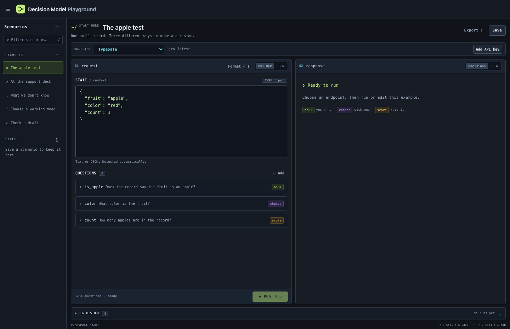

# Decision Model Playground

A compact workspace for asking decision models small, structured questions. Bring a compatible endpoint or a TypeSafe API key, edit the evidence, and see how the answers change.



## Start

Install [Node.js 24 or newer](https://nodejs.org/), open a terminal in the project folder, and run:

```bash
npm start
```

Open **http://127.0.0.1:3000**. There are no npm dependencies to install, build steps, model downloads, or database services. The playground runs on macOS, Linux, and Windows; your model runs separately.

## Connect a model

Use the **Endpoint** dropdown above the editor:

- **Your endpoint:** choose **＋ Add endpoint…**, enter a name, URL and model ID, then add it. It becomes the selected endpoint. Use the **Imajev** profile for its smaller question limit, or **Compatible API** for another implementation.
- **TypeSafe:** select **TypeSafe**, click **Add API key**, and enter your own key. Calls use its official API and `jev-latest` model alias.

Choose **Endpoint settings…** in the same dropdown to view the selected connection's URL, add or remove its key, or delete a custom endpoint. Custom keys are optional bearer tokens.

Root URLs, `/v1`, and full `/v1/systemone` URLs are accepted, including reverse-proxy prefixes. Custom servers must implement the [TypeSafe decision API contract](https://docs.typesafe.ai/api). This is an independent playground; compatibility does not imply identical answers, calibration, or confidence across providers.

The endpoint selector determines where each run goes. **Check** calls model discovery without running inference. An endpoint that lacks `GET /v1/models` can still support **Run** through `POST /v1/systemone`. No request is automatically retried.

## Try it

1. Start with **The apple test**. Its three questions demonstrate each answer type.
2. Change a fact in **State**, or write ordinary text. JSON objects and arrays are recognized automatically.
3. Edit the questions and press **Run**. Inspect the charts or the original response JSON.
4. Save a scenario, export it as JSON, or open a previous run to compare another model.

| Type | Ask for | Result |
| --- | --- | --- |
| `noul` | A yes/no judgment | A value from 0 (no) to 1 (yes) |
| `choice` | One of your named options | The selected option and a probability for each option |
| `score` | A position on your ordered rubric | A probability-weighted value; levels start at 0 |

Confidence is displayed as reported by the provider. Optional unknown-probability and abstention fields appear only when supplied. A high percentage is not a guarantee of correctness. [Request and response details →](docs/api.md)

The editor includes five examples, automatic draft recovery, JSON formatting, friendly validation, import/export, up to 100 saved scenarios, and the latest 30 runs. Rich-text JSON paste is supported; duplicate keys and unsafe numbers are rejected. Use **Ctrl/Cmd + Enter** to run, **Ctrl/Cmd + S** to save, and **/** to search scenarios.

## Your data and keys

Connections, saved scenarios and history live in this browser's IndexedDB. The current draft uses local storage. Export scenarios for backups or to move them to another browser; clearing site data removes the local workspace.

API keys live in the current tab's session storage, with an in-memory fallback if that storage is blocked. They survive refresh when session storage is available. Browser session restoration or duplicating a tab may restore/copy session storage; use **Remove key** when finished on a shared device. Another browser must supply its own key.

Requests pass through the playground's Node server to the selected provider. That server sees the request and credential while forwarding them, but does not persist them or log request contents. TypeSafe keys are restricted to its official API; custom endpoint keys are kept in separate slots. Connection credentials are excluded from scenario exports and run history. Provider retention policies and account charges still apply.

## Development

```bash
npm run dev           # Restart when server files change
npm test              # Contract, storage logic and real HTTP regression tests
npm run test:browser  # UI checks with local Chrome/Chromium
npm run check:repo    # Check for accidental secrets and machine-specific files
```

Set `BROWSER_BIN` if Chrome/Chromium is not detected. Tests use temporary browser profiles and local fake providers; no keys or live model calls are required. GitHub Actions runs the checks on Node 24 and 26.

The code is plain JavaScript: `public/` contains the UI, validation and browser storage; `lib/` contains the API relay; `server.mjs` starts the HTTP server. See [CONTRIBUTING.md](CONTRIBUTING.md) for the development conventions.

## Running on another port or host

The default listener is `127.0.0.1:3000`. `PORT` changes the port. For network access, set `HOST` and `APP_ORIGIN` to the exact URL users will open. For example, in a POSIX shell:

```bash
HOST=0.0.0.0 PORT=3000 APP_ORIGIN=https://playground.example.com npm start
```

Configure your HTTPS reverse proxy to preserve that host. On Windows, set the same environment variables in your shell before `npm start`. This app needs a Node server and cannot run on static GitHub Pages alone.

Custom URLs are contacted from the server's network, including LAN addresses. The app has no user accounts; if you host it for others, put access control in front of it. The per-process request token protects local browser requests from forgery; it is not user authentication. [Hosting and data flow →](docs/architecture.md)
